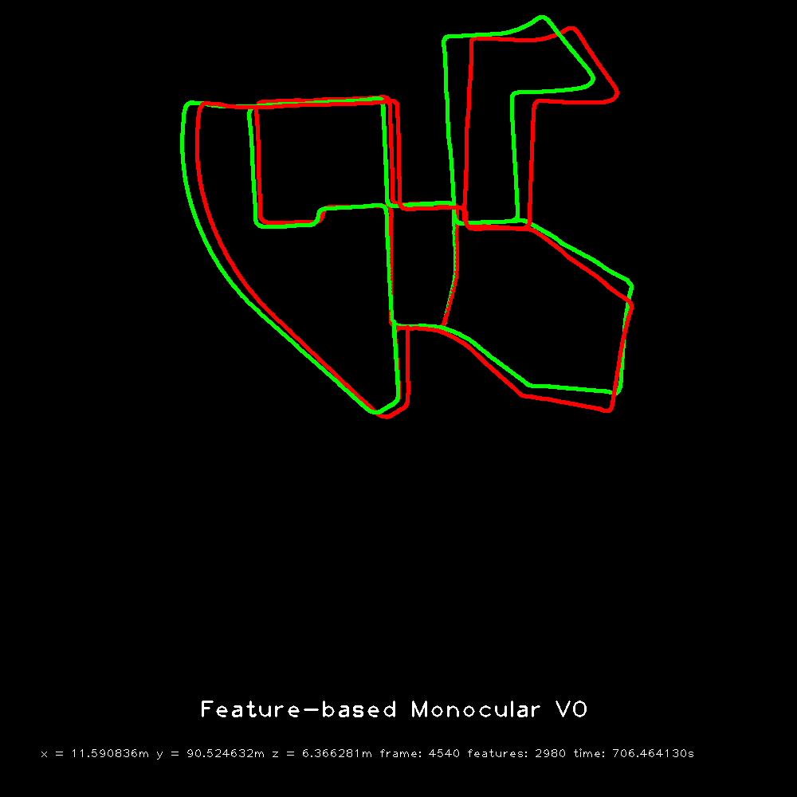
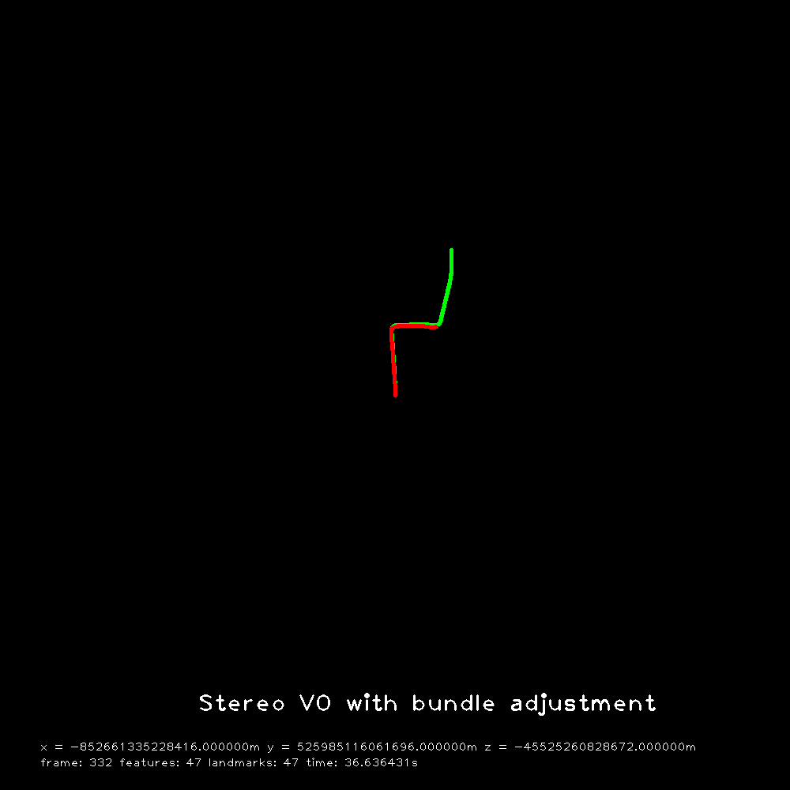

# visual odometry

This is an OpenCV 3.4 implementation on [KITTI's Visual Odometry Dataset (greyscale)](http://www.cvlibs.net/datasets/kitti/eval_odometry.php)

## Method
2D-2D Monocular VO and 2D-3D Stereo VO  
Implemenation details in [report](wudao_final.pdf)

## Compile
In 2 directory:  
```bash
mkdir build
cd build
cmake ..
make
```

## Run
After compilation, in the build directly  
Mono
```bash
./vo [sequence ID] [dataset directory]
```
Stereo
```bash
./vo [sequence ID] [max frame] [optimize frame] [dataset directory]
```

## Performance


